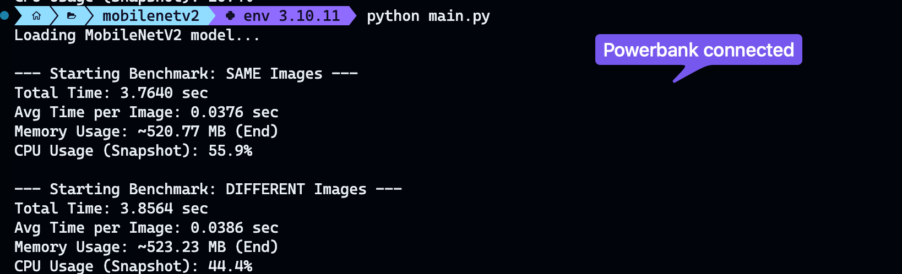
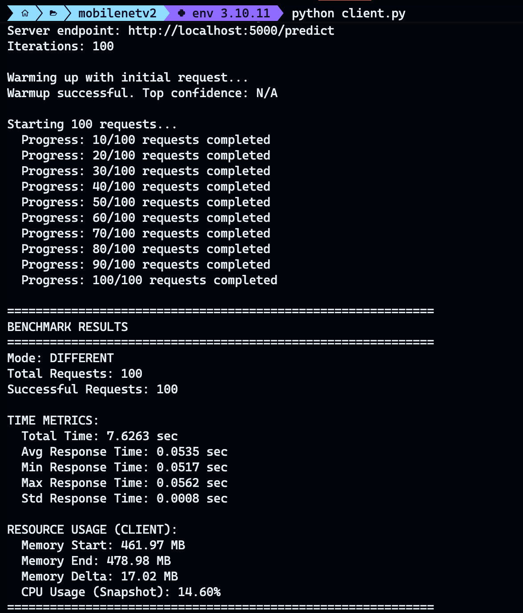

# Week3-Group4

---

## **Task 1: Vertical Scaling Evaluation Report**

### **1. Objective**

The primary goal of this experiment was to evaluate the impact of hardware configuration and power management on the inference performance of a Deep Learning model (**MobileNetV2**) running locally at the **Edge**.

### **2. Methodology**

We developed a Python script utilizing **TensorFlow/Keras** and **NumPy** to perform the following:

* **Model Initialization:** Loaded MobileNetV2 with pre-trained weights.
* **Data Generation:** Generated dummy input tensors of shape .
* **Inference Loop:** Executed 100 consecutive predictions.
* **Test Scenarios:** 1.  **Uniform Input:** Same images across all test iterations.
2.  **Diverse Input:** Different random images for each iteration.
* **Resource Monitoring:** Captured CPU/RAM utilization and precise execution latency (Start/End times).

---

### **3. Experimental Results**

Based on our testing across the group's hardware, we observed a significant performance delta between power modes:

| Metric | Power Saver Mode (Unplugged) | High Performance Mode (Plugged In) |
| --- | --- | --- |
| **Inference Latency** | Higher (Slower) | Lower (Faster) |
| **CPU Clock Speed** | Throttled / Scaled Down | Maximum Performance |
| **Consistency** | High variability due to power saving | Stable and Rapid |

**Key Finding:** When connected to a power source, the CPU is permitted to operate at its maximum frequency without thermal or battery-saving constraints. This directly translates to faster mathematical computations required for the neural network's layers.

---

### **4. Analysis and AIoT Implications**

#### **Vertical Scaling & Hardware Capability**

Vertical scaling in this context refers to optimizing the individual "Edge" node. Our results show that hardware configuration (Power Profile) is just as critical as raw specs.

* **High Performance Mode:** Ideal for real-time AIoT applications (e.g., surveillance or industrial defect detection) where low latency is mandatory.
* **Power Saver Mode:** Suitable for non-critical periodic monitoring where battery longevity is prioritized over speed.

#### **Model Selection: MobileNetV2 vs. Others**

* **MobileNetV2** is highly optimized for Edge devices using depthwise separable convolutions.
* **Heavier Models (e.g., ResNet50, VGG16):** If we utilized larger models, the performance gap between "Power Saver" and "High Performance" would likely widen. Heavier models require more FLOPs (Floating Point Operations), making them even more sensitive to CPU throttling and memory bandwidth limits.

---

### **5. Visual Evidence**

The following images document the resource consumption and execution logs during the test:

* ****
* ****

https://www.canva.com/design/DAG_f5ysPx4/z-lyzf3KjjCzknzAGIFPfQ/edit?utm_content=DAG_f5ysPx4&utm_campaign=designshare&utm_medium=link2&utm_source=sharebutton


## **Task 2**

* ****

---

## **Task 4: Edge, Fog and Cloud Smart Routing System**

### **1. Objective**

Design and implement a smart routing solution that works as an intelligent router, deciding whether to process ML inference locally on the Edge, offload to Fog, or forward to the Cloud based on image complexity.

### **2. Architecture**

The system implements a three-tier distributed computing architecture:

| Node | Role | Description |
| --- | --- | --- |
| **Cloud** | Server Only | Most powerful device - processes complex images |
| **Fog** | Server + Client | Medium capability - acts as intermediary, processes medium complexity images |
| **Edge** | Client Only | Standard device - processes simple images locally |

**Routing Chain:**
```
Edge Client → Fog Server → Cloud Server
```

### **3. Smart Routing Logic**

The routing decision is based on **image complexity** measured using the variance of pixel values (`np.var(image)`):

| Complexity (Variance) | Processing Location |
| --- | --- |
| < 2000 | **Edge** (Local processing) |
| 2000 - 3500 | **Fog** (Intermediate processing) |
| ≥ 3500 | **Cloud** (Remote processing) |

### **4. Image Generation**

To test the routing system effectively, three types of images are generated:

* **Simple Images** (Low Variance ~100-500): Nearly uniform color with minimal noise
* **Medium Images** (Medium Variance ~1000-3000): Gradient patterns with moderate noise
* **Complex Images** (High Variance ~5000-7000): Fully random pixel values

### **5. Implementation Details**

**Files Created:**
* `edge_client.py` - Edge device with local MobileNetV2 model and smart routing
* `fog_server.py` - Fog node with dual server/client functionality

**Key Features:**
* Variance-based complexity calculation on raw images (0-255 range)
* Automatic routing decisions at each tier
* Comprehensive latency tracking by inference source
* Statistics reporting (requests per location, latency metrics)
* Support for 50+ inference requests per benchmark

### **6. Results**

The benchmark results show the distribution of inference requests across the three tiers and latency statistics for each processing location.

* ****
* ****


---
